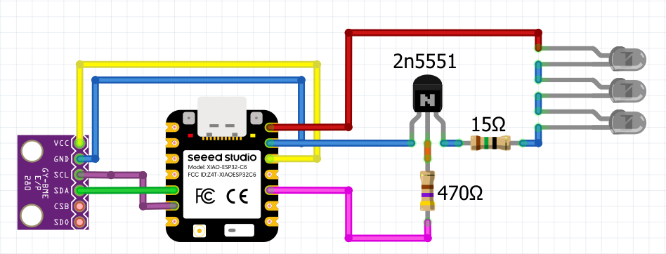
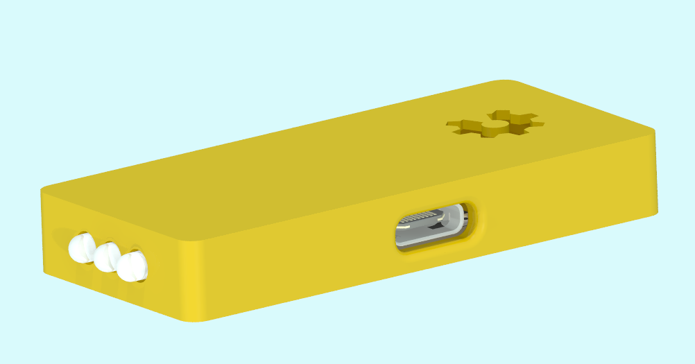
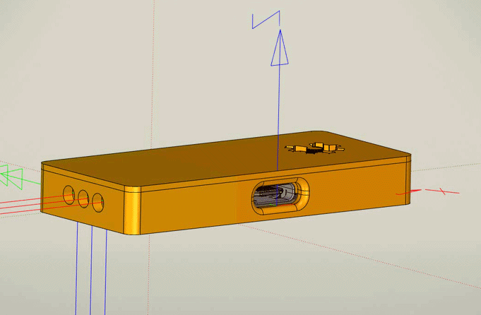

# IR AC Controler on ESPHome
An IR-based air conditioner controller with [ESPHome](https://esphome.io/) and ESP32-C6
>[!NOTE] 
>A small weekend DIY project for my smart home.

### Sheet

### Component List
| Component | Qty | Link |
|-----------|-----|------|
|Seeed Studio XIAO ESP32C6|1| [Getting Started](https://wiki.seeedstudio.com/xiao_esp32c6_getting_started/) |
|GY-BMP280-3.3 Pressure Sensor Module|1|[Datasheet](https://5.imimg.com/data5/SELLER/Doc/2022/1/WG/FV/GY/1833510/gy-bmp280-3-3-high-precision-atmospheric-pressure-sensor.pdf)|
|NPN transistor 2N5551|1|[Datasheet](https://www.onsemi.com/download/data-sheet/pdf/2n5551t-d.pdf)|
|3mm IR LED 940nm|3|[Datasheet](https://www.everlighteurope.com/custom/files/datasheets/DIR-0000248.pdf)|
|Resistor 15ohm|1||
|Resistor 470ohm|1||
### ESPHome config
To program your device, add this code to your ESPHome YAML config file.
```yaml
i2c:
  sda: GPIO22
  scl: GPIO23
  scan: True
  id: i2c_bus
  frequency: 1000Hz

sensor:
  - platform: bmp280_i2c
    temperature:
      id: "Temperature"
      name: "Temperature"
      oversampling: 16x
    pressure:
      name: "Pressure"
    address: 0x76
    update_interval: 600s

remote_transmitter:
  pin: GPIO20
  carrier_duty_percent: 50%

# For your AC, see the following link - https://esphome.io/components/climate/climate_ir/
climate:
  - platform: gree
    name: "AC"
    model: yan
    sensor: Temperature
```
**Or**

Add define `ha_key`, `ota_password`, `wifi_ssid`, `wifi_password`, `ap_wifi_ssid`, `ap_wifi_password` in your secret YAML. Then create the device using [script.yaml](script.yaml).
```yaml
wifi_ssid: "YOUR_SSID"
wifi_password: "YOUR_PASS"

ha_key: "YOUR_HA_KEY"
ota_password: "YOUR_OTA_PASS"

ap_wifi_ssid: "YOUR_AP_SSID"
ap_wifi_password: "YOUR_AP_PASS"

```
>[!IMPORTANT]
>Setings for your AC can be found in the - ["IR Remote Climate"](esphome.io/components/climate/climate_ir/) documentation.
## Case
Download STL files from ~~[Makerworld]()~~ or  the [STL](stl) folder. Sourese files are in the [case](case) folder.


The case is designed for 3 mm LEDs. If you have 5 mm LEDs, there is an IR LED diameter parameter(D_led) in the source files of the case. It is recommended to add 0.2–0.4 mm tolerance when printing the case.


#### The following parameters were used for 3D printing:
 - Layer height - 0.2mm
 - Default line width - 0.4mm
 - Inner line width - 0.6mm
 - Wall loops - 3
 - Fuzzy skine type - Ridged
 - Fuzzy skine thinckness - 0.1mm